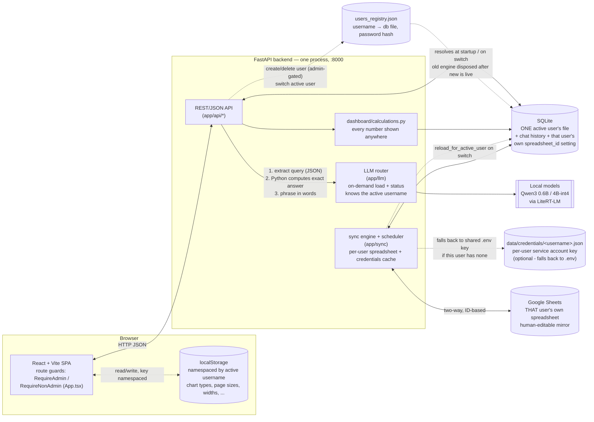
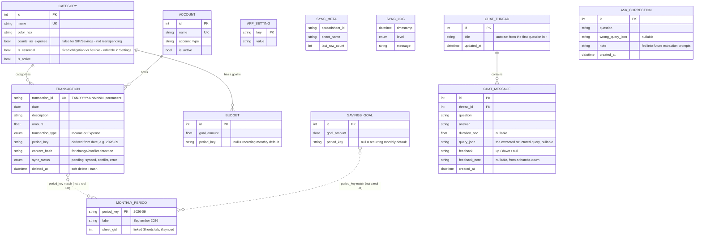

# Budget Tracker

A long-term, extensible budget tracker with two-way Google Sheets sync. A local
SQLite database is the source of truth; Google Sheets is a synchronized,
human-editable mirror. See `../plans` (or ask Claude) for the full design
rationale - the short version:

- **Never loses data**: every write lands in SQLite first; Sheets sync is best-effort
  and retries with backoff.
- **Never depends on row numbers**: every transaction has a permanent `TXN-YYYY-NNNNNN`
  ID; sync always locates rows by scanning for that ID.
- **Works for any year, indefinitely**: months/weeks/years are derived from
  transaction dates, nothing is hard-coded to 2026.
- **Conflicts are surfaced, never silently overwritten**: the Conflicts page lets
  you pick "Keep App" or "Keep Sheets" per transaction.
- **Backend and frontend are separate**: `backend/` is a FastAPI JSON API
  (Python); `frontend/` is a React + Vite + TypeScript single-page app. FastAPI
  serves the frontend's built output directly, so it's still one process, one
  port (`http://127.0.0.1:8000`) day to day.

## Features

- **Two-way Google Sheets sync**, per user (see below) - your own spreadsheet
  stays a human-editable mirror of the SQLite source of truth, conflicts
  surfaced rather than silently overwritten.
- **Multi-user, fully isolated**: every profile is its own SQLite file, its
  own optional password, its own Sheets spreadsheet + credentials, and now its
  own remembered UI state (chart types, page sizes, drawer widths, KPI
  order) - switching profiles always shows that profile's own views, never
  whatever the previous one left on screen. See "Multi-user & admin" below.
- **A dedicated `admin` profile** for user management only - create, delete
  (with a real confirmation dialog), and see disk usage/transaction counts for
  every profile. It has no financial data of its own and its nav is
  restricted to just that page, enforced by route guards, not just a hidden
  link.
- **"Ask your budget"**, a local-LLM chat that answers questions against your
  real transactions - never lets the model do arithmetic (Python computes the
  exact number, the model only phrases it), shows the actual matching rows it
  computed from, and knows which profile is asking. It also **learns from
  👎 feedback** within a session/profile: see "How the self-learning feedback
  loop works" below.
- **AI autocomplete/categorization** while entering transactions, and an
  AI-generated Dashboard insight/anomaly summary - all via small local models
  (Qwen3 via LiteRT-LM), no cloud calls, no API key required for these.
- **Runs entirely locally**: one process, one port, a local SQLite file as the
  source of truth. Google Sheets and the local LLM are both optional add-ons,
  not requirements to use the app.

## Architecture



Every write lands in SQLite first, through the API; the sync engine runs on a
background schedule (and on-demand via "Sync Now") to reconcile SQLite with
Sheets in both directions. The LLM router loads each local model once and
routes each AI feature (autocomplete, categorize, quick-add, the Dashboard's
AI-generated explanation, anomaly detection's summary, "ask your budget") to
whichever model is configured for it - a small model for per-keystroke tasks,
a larger one for anything that can afford to be slower. A model loads lazily
on first use unless it's in the small eagerly-loaded set (autocomplete/
categorize, warmed at startup); the Ask page instead calls `/api/llm/
model_status` and `/api/llm/warmup` itself the moment it opens, so it can show
an explicit "loading the model" state up front rather than the first real
question silently taking up to a minute.

"Ask your budget" never lets the model do arithmetic: a grammar-constrained
JSON call turns the question into a structured query (categories, an optional
keyword search against transaction descriptions, a date range, and an
aggregation - sum/count/avg/or a category breakdown), Python computes the
exact answer against `Transaction` directly, and only then does a second,
short LLM call phrase that already-computed number into a sentence. Each
question and its answer are saved as a `ChatMessage` under a `ChatThread` (the
Ask page's tabs), so history survives a reload; a thread also includes its
last few exchanges in the next question's prompt, so follow-ups like "what
about last month?" resolve correctly. Every answer also ships the actual
matching `Transaction` rows it computed from ("N matching transactions found"
in the UI) and a heuristic confidence label, so you can check the real
evidence instead of only trusting the sentence.

### How the "self-learning" feedback loop works

This is real feedback-driven behavior change, but it is **not** model
fine-tuning - retraining even a small quantized local model on a personal
machine isn't practical, and framing it as such would be misleading. What it
actually is: a small, inspectable, growing memory of confirmed mistakes that
gets fed back into future prompts.

1. Every answer has a 👍/👎. A 👎 can include a short note (e.g. "should have
   excluded transfers").
2. That feedback is saved on the `ChatMessage` itself (`feedback`,
   `feedback_note`), along with the exact structured query that was extracted
   for it (`query_json`) - so a correction has something concrete to point at,
   not just free text.
3. Every 👎 also creates an `AskCorrection` row (the question, what was
   extracted, and the note if one was given) - even a bare 👎 with no note,
   since that's still a real signal that this question got a wrong answer.
4. On the next few questions, the extraction prompt includes recent
   corrections **that have a note** verbatim, under a "known past mistakes -
   do not repeat these" heading - a note-less correction has nothing
   actionable to say, so it's skipped here even though the row exists.
5. The confidence heuristic shown under each answer checks (via word overlap,
   no embeddings) whether the current question closely resembles ANY past
   correction - noted or not - and marks it "low" if so: "we've been burned
   on something like this before" is worth flagging even without knowing
   exactly what went wrong.

This is deliberately bounded and disposable, not a growing liability: corrections
are plain rows in `ask_corrections`, only the most recent few are ever injected
into a prompt (old ones age out of relevance on their own rather than needing
active pruning), and deleting a chat thread or clearing corrections never
touches your actual transaction data.

## Multi-user & admin

Each user is a **completely separate SQLite file**, not rows scoped by a
`user_id` - the strongest possible isolation, at the cost of a user only ever
being able to see their own data (by design; there's no cross-user anything).

- **`app/user_registry.py`** is a small JSON file (`data/users_registry.json`)
  mapping `username → db file` plus which one is currently active. It has to
  be plain JSON, not a database table, because it's what decides *which*
  database file this process even opens - it exists a layer below `app/db.py`.
- **Switching users rebinds the process's live engine**, in place, via
  `switch_active_db()`. Every repository and API route reaches the database
  only through `get_session()`/`session_scope()`, which look up the current
  `engine`/`SessionLocal` by name at call time rather than holding their own
  reference captured at import time - so a switch takes effect immediately
  everywhere (the sync scheduler, LLM chat, everything) with no other code
  needing to know it happened. The *previous* engine is disposed only after
  the new one is confirmed live, specifically because a lingering pooled
  connection left on the old SQLite file blocks deleting that file on Windows.
- **A brand new install starts on `admin`, alone, with nothing configured -
  not even Sheets.** The first time `users_registry.json` doesn't exist yet
  (`UserRegistry.ensure_admin_exists()`), it's created with exactly one user,
  `admin`, active - no financial profile, no spreadsheet, no credentials.
  You create your first real profile from the Admin page, at which point
  `create_empty_db()` registers it and creates its own empty `.db` file (see
  below) - `admin` itself never gains transactions of its own. (This
  install's original single-user database went through an earlier, one-time
  version of this bootstrap that adopted the pre-existing file under a named
  profile instead - that migration only ever ran once and doesn't apply to
  new installs going forward.)
- **Creating a user never touches the active session.** `create_empty_db()`
  and `session_for()` open a throwaway engine bound to the *new* file,
  seed it (default categories/account, optionally `demo_data.py`'s synthetic
  year of transactions), and dispose that engine when done - the
  currently-active user's own connection is untouched throughout.
- **Passwords are per-profile, salted PBKDF2-HMAC-SHA256** (`app/
  user_registry.py`, stdlib `hashlib` only - no new dependency), stored as
  `password_hash` on that user's registry entry. A profile with no password
  set verifies as open on both activation and admin-gated actions - this is a
  personal, single-machine app being retrofitted with passwords, not a fresh
  multi-tenant system, so an existing profile must keep working exactly as it
  did before its owner deliberately sets a password (Settings → Account).
- **Creating or deleting a user is gated by the `admin` account's own
  password**, independent of whichever profile happens to be active -
  `_require_admin()` in `app/api/users.py` checks it directly, so you don't
  have to switch into "admin" just to add a user. Also open (no check) until
  an `admin` user exists and has actually set a password, for the same
  backward-compatible reason as above.
- **Google Sheets sync is per-profile on both axes - spreadsheet AND
  credentials** (`app/sync/scheduler.py`). Each user has their own
  `spreadsheet_id` and, optionally, their own uploaded service account key
  (`data/credentials/<username>.json`, validated as a real service-account
  JSON - `type`, `client_email`, `private_key` - before being saved); a user
  with no key of their own falls back to the shared default in `.env`
  (`GOOGLE_SERVICE_ACCOUNT_KEY_PATH`). Both are cached in memory and reloaded
  by `reload_for_active_user()` on every switch - this exists because of a
  real near-incident: before this fix, switching to a demo profile inherited
  the previous user's cached spreadsheet id, which would have pushed the demo
  profile's synthetic transactions into the real Google Sheet on the next
  sync tick. `GOOGLE_SPREADSHEET_ID` in `.env` is now only ever consulted
  once, to migrate the original setup's spreadsheet into that same user's own
  setting - never applied to any other/new profile.
- **The Admin page** (`/admin` - while signed in as `admin`, it's the *only*
  nav item shown, since that profile is never a financial one) lists every
  user with live disk usage and transaction count (`GET /api/users/stats` -
  opens a throwaway session per user, same pattern as creation), and lets you
  create or permanently delete a profile - deletion asks for confirmation via
  a real dialog (shadcn `AlertDialog`, not `window.confirm`), refuses to
  delete the currently active user or the last remaining one, and removes the
  actual `.db` file on disk, not just the
  registry entry.
- **Admin's restriction is enforced by route guards, not just a hidden nav
  link.** `RequireNonAdmin`/`RequireAdmin` (`frontend/src/App.tsx`) wrap every
  route: typing/pasting `/settings` (or any other page) while `admin` is
  active redirects straight back to `/admin` instead of rendering it - this
  matters because Settings includes the Google Sheets card, which is
  meaningless for a profile with no transactions or spreadsheet of its own.
  The same guard redirects any *non*-admin profile away from `/admin` too.
- **UI view state (chart types, page sizes, drawer widths, KPI tile order,
  the transactions edit-lock) resets to each profile's own values on
  switch**, not the previous profile's. `useLocalStorage`
  (`frontend/src/lib/useLocalStorage.ts`) namespaces every key by the
  currently active username under the hood, so every existing call site got
  this for free with no per-component changes - switching users changes the
  namespace, which re-reads (or defaults) that profile's own value instead of
  showing whatever the last-active profile had on screen. (Dark/light theme
  is deliberately the one exception left un-namespaced - that's a
  per-browser preference, not a "view" of a specific user's data.)

## Data model



`Transaction` is the only table most features touch - `category_id`/`account_id`
are real foreign keys, but `period_key` (also on `Budget` and `SavingsGoal`) is
just a derived string (`YYYY-MM`) compared by value, not a foreign key -
`MonthlyPeriod` exists purely to remember which Sheets tab (`sheet_gid`) backs
each period, not to constrain anything. `SyncMeta`/`SyncLog` track the sync
engine's own state and aren't referenced by anything else. `dashboard/
calculations.py` (the single source of truth for every number shown anywhere)
reads `Transaction` joined to `Category`/`Account` directly - it never goes
through the API layer. `ChatThread`/`ChatMessage` back the Ask page's tabs and
history - they're independent of `Transaction` (Ask computes its answers by
querying `Transaction` fresh each time, not from anything stored on a message)
and aren't read by `dashboard/calculations.py` or the Sheets sync at all.
`AskCorrection` has no foreign key to the `ChatMessage` it came from - it's a
standalone table of "lessons learned" that future questions' extraction
prompts read from directly (see "How the self-learning feedback loop works"
above), not a record tied to one specific past conversation.

## First-time setup

1. Double-click `run.bat` (repo root). It builds the frontend (`npm install` +
   `npm run build`), creates a Python 3.13 virtual environment for the
   backend, installs dependencies, creates `backend/.env` from
   `backend/.env.example` (first run only), and opens
   http://127.0.0.1:8000 in your browser.
2. A brand new install lands you on the `admin` profile - no financial data,
   no nav besides Admin, by design (see "Multi-user & admin"). Use the "New
   user" button there (bottom of the left nav) to create your own profile -
   no password required unless you want one - then switch into it. Dashboard
   and Transactions work immediately from there - no Google account needed
   yet.
3. When you're ready to turn on sync, follow `backend/docs/service_account_setup.md`
   (about 5 minutes) to get a service account key, then upload it and set
   your spreadsheet ID from **Settings -> Google Sheets sync**, from inside
   your own profile (not `admin`, which has no Settings page). No restart or
   `.env` edit needed - it's saved straight into that profile.
4. **To stop**: close the console window or press Ctrl+C in it. `run.bat`
   deletes `backend/.venv` on the way out to save disk space, and rebuilds it
   fresh (a ~10-20s pip install) the next time you launch it.
   `frontend/node_modules` and `frontend/dist` are **not** deleted - npm
   installs are slow, so only the Python venv gets the fresh-each-launch
   treatment. `.env` and `data/*.db` are untouched either way.

## Running with Docker (alternative to `run.bat`)

```
docker compose up --build
```
This builds the frontend and backend into one image (`Dockerfile`, multi-stage:
Node builds the React app, Python serves it) and starts it at
`http://127.0.0.1:8000`. Requires `backend/.env` to already exist (copy from
`backend/.env.example` if you haven't run `run.bat` at least once) and your
service account key at `../credentials.json` relative to this repo - adjust
the source path in `docker-compose.yml`'s `volumes:` section if yours lives
elsewhere. `GOOGLE_SERVICE_ACCOUNT_KEY_PATH` from `backend/.env` is
automatically overridden to the in-container mount path, since the Windows
host path in `.env` wouldn't resolve inside the container.

`backend/data/` is bind-mounted so the SQLite database survives
`docker compose down` / rebuilds. Stop with `docker compose down`; add `-v`
only if you also want to discard the data volume (you don't, normally -
`backend/data` is a bind mount to your own filesystem, not a Docker volume,
so your data is already safe on disk either way).

**Note**: I wrote and validated this compose file's config (`docker compose
config` resolves correctly - env vars merge, volume paths resolve to the
right absolute paths) but couldn't actually build or run the image, since
Docker Desktop's engine wasn't running in this environment. Run `docker
compose up --build` yourself to confirm the image actually builds and starts
cleanly before relying on it.

## Project layout

```
budget_tracker/
  run.bat                the one entry point - builds frontend, starts backend
  backend/
    app/
      models.py, repositories/    the database and its access layer
      sheets/                      all Google Sheets API calls (only place that talks to Google)
      sync/                        two-way sync engine, background scheduler, report generation
                                    (the human-readable monthly/weekly/yearly/Dashboard sheet tabs)
      dashboard/calculations.py    every number shown anywhere comes from here
      api/                         the REST/JSON API - the only thing the frontend talks to
      auth.py                      optional HTTP Basic Auth (off unless configured) - global, not per-user
      user_registry.py             username → db file mapping, password hashes; see "Multi-user & admin"
      demo_data.py                  synthetic year of transactions for a "fill with demo data" user
      cli.py                       command-line interface
    scripts/seed_from_existing_xlsx.py   the one-time historical importer
    tests/                         pytest suite - fake Sheets adapter, in-memory SQLite
    docs/service_account_setup.md
    data/
      sagnik.db, demo.db, admin.db, ...             one file per user, named `{username}.db`
      users_registry.json                          username → db file, active user, password hashes
  frontend/
    src/
      pages/            Dashboard, Transactions, Import, Compare, Conflicts, Trash, Settings, Admin
      components/       NavBar, TopRightDrawers (Ask/Logs), UserSwitcher, SyncStatus, chart cards, etc.
      lib/api.ts         typed fetch wrappers - one function per backend endpoint
    dist/                the built app FastAPI serves (generated, gitignored)
```

## Importing the historical data (already done once)

The five months of data from the old spreadsheet were imported via:
```
cd backend
python scripts/seed_from_existing_xlsx.py "../../Monthly Budget Sagnik Das.xlsx"
```
This only needs to run once - re-running it against the same file will create
duplicate transactions (it always assigns fresh IDs), so don't re-run it
unless you first clear `backend/data/sagnik.db`.

## Everyday use

- **Web UI**: Dashboard / Transactions / Import / Compare / Conflicts / Trash /
  Settings in the left nav (plus Admin, only while signed in as `admin`); Ask
  and Sync Logs are drawers reachable from the top-right corner on every page
  instead, not routed tabs - Ask in particular keeps running (and keeps its
  chat state) if you switch left-nav tabs mid-question, since it's mounted
  once outside the routed area, not per-page. The Dashboard's charts have a
  type switcher (bar/line/pie/donut/sunburst where it makes sense), the KPI
  tiles are drag-to-reorder, and clicking a category in the breakdown chart
  drills into its transactions. The user switcher (bottom of the nav) is
  where you swap profiles or create a new one.
- **CLI** (needs `backend/.venv`, which only exists while `run.bat`'s window
  is open - run these from a *second* terminal):
  ```
  cd budget_tracker/backend
  .venv\Scripts\activate
  python -m app.cli add-transaction -d "Coffee" -a 150 -t Expense -c Shopping
  python -m app.cli list --year 2026 --month 9
  python -m app.cli dashboard --range this_month
  python -m app.cli sync-now
  python -m app.cli category add "Pets" --color "#e87ba4"
  python -m app.cli category list
  ```
- Categories, accounts, per-category budgets, and the overall Net Savings goal
  are all editable from **Settings** (or the CLI/API) - the seeded defaults
  are just a starting point.
- **Frontend dev mode** (hot reload while editing `frontend/src/`): with the
  backend already running via `run.bat`, open a second terminal:
  ```
  cd budget_tracker/frontend
  npm run dev
  ```
  This serves the frontend on its own port (usually :5173) and proxies
  `/api/*` calls to the backend on :8000 (configured in `vite.config.ts`).
  Changes to `.tsx`/`.css` files show up instantly. This is separate from
  what `run.bat` runs day to day (`npm run build`, served by FastAPI).

## Running tests

```
cd backend
python -m pytest tests/
```
Tests run against an in-memory SQLite database and a fake Sheets adapter - no
network calls, no real Google credentials needed.

## A note on Python version

`run.bat` pins the backend's virtual environment to Python 3.13 explicitly
(`py -3.13`), independent of whatever else is installed on this machine -
including the Python 3.9 install used by other projects here, which is
untouched and unaffected by anything in this repo.

## Known limitations, tradeoffs & future directions

Every design choice here was made for what this app actually is - a personal,
single-machine tool, not a hosted multi-tenant product - and would need
revisiting if that ever changed.

**Single active user per process, not per session.** Switching users rebinds
the whole process's database connection (`switch_active_db()`) - there's no
concept of "this browser tab is Sagnik, that one is demo" at the same time.
Two tabs open as different people fight over the same active profile, and a
request that lands mid-switch could theoretically read against the wrong
engine for an instant. Fine for one person on one machine; a real blocker for
several people using the same running instance concurrently. Fixing this
properly means per-request/session auth (a token or cookie identifying the
user on every request) instead of a process-global "active user" flag - a
significant rework, not a small patch.

**A password gates *switching into* a profile, not standing sessions.**
There's no login token or cookie - "being" a user is just whichever profile
the shared process currently has active. Anyone at the machine (or on the
network, if `APP_HOST` is ever bound beyond `127.0.0.1`) can attempt to
switch into any profile; a password only stops the switch from completing,
with no rate-limiting or lockout on attempts. A password-less profile is
wide open by design (see "Multi-user & admin"). This is an acceptable
tradeoff for a single-machine tool behind your own login, not a real
authentication system.

**File-per-user isolation is simple but doesn't scale or share.** Each
profile is a fully separate SQLite file - strong isolation, trivial backup
(copy one file), but no cross-profile queries (no combined household
dashboard across two profiles), no shared categories/accounts (every new
profile starts from the same seeded defaults, independently), and schema
migrations only apply to whichever file is active at the moment
(`_add_missing_columns()` in `app/db.py` runs at startup against the *active*
engine only - a profile that hasn't been switched into since a schema change
picks up the new column the next time it's activated, not immediately). More
profiles also means more files to individually keep an eye on for growth,
corruption, or backup coverage - there's no single place that covers all of
them at once. `users_registry.json` itself has no locking, but a single
Uvicorn worker process makes that a non-issue today.

**Sync is polling-based and best-effort, not real-time or transactional.**
The scheduler wakes up every `SYNC_INTERVAL_SECONDS` rather than reacting to
a push/webhook from Sheets, so a manual edit there can take up to that long
to show up (or "Sync Now" to force it). Conflicts are surfaced for a human
to resolve (Keep App / Keep Sheets), not auto-merged - correct for a
personal ledger where a wrong automatic merge is worse than a manual click,
but real latency and manual effort compared to a proper OT/CRDT sync engine.

**Local LLM features have a real quality ceiling.** Qwen3 0.6B/4B
(quantized, via LiteRT-LM) is nowhere near a frontier cloud model - the
extraction step in "Ask your budget" can misparse an oddly-phrased question,
and there's no way to point it at a larger model without a much beefier
machine. The tradeoff is deliberate: zero API keys, zero cloud calls, zero
per-query cost, works fully offline - but a "just ask it anything" complex
question is a place it will still stumble compared to raising the ceiling
with a cloud model as an opt-in.

**No automated backups beyond Sheets acting as a secondary mirror.** Losing a
profile's `.db` file (disk failure, an accidental delete) loses that
profile's data outright unless a manual copy was made or its own Sheets sync
was up to date - sync is a mirror, not a guaranteed durable backup.

**Frontend ships as one JS bundle** (~1.8MB, per Vite's own build warning) -
irrelevant for a local app on localhost, but it means no meaningful
code-splitting exists yet if this were ever served over a slower connection.

### Ideas for future expansion

- **Per-session auth** (a real login token/cookie per browser, not a
  process-global active-user flag) - the prerequisite for genuinely
  concurrent multi-user access from different devices at once.
- **An opt-in, read-only combined view across profiles** (e.g. a household's
  total net worth) without merging the underlying isolated databases -
  aggregate at query time across each profile's file rather than changing
  the storage model.
- **Push-based Sheets sync** (Drive API change notifications) instead of
  fixed-interval polling, to cut sync latency without hammering the API on a
  tight interval.
- **Real schema migration tooling** (e.g. Alembic) once `_add_missing_columns()`'s
  "ADD COLUMN only" approach outgrows what it can safely express (renames,
  drops, or backfills that need real data transformation, not just a new
  nullable column).
- **Scheduled local backups** of each profile's `.db` (e.g. a nightly
  rotating copy into `data/backups/`), independent of whether Sheets sync
  happens to be configured or healthy for that profile.
- **An opt-in larger/cloud model for "Ask"** for people willing to trade the
  zero-cost/fully-offline property for materially better question
  understanding on complex asks, while keeping the local model as the
  no-setup default.
- **Frontend code-splitting** (route-based dynamic `import()`) now that the
  bundle-size warning exists, mainly relevant if this is ever served to
  anyone over a real network rather than localhost.
- **A profile starter-kit/template** (clone another profile's category and
  account setup into a new one) so a new profile doesn't have to rebuild a
  taxonomy from the seeded defaults by hand.
