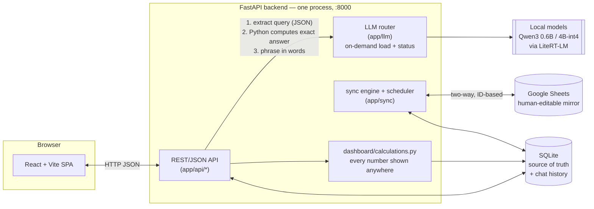
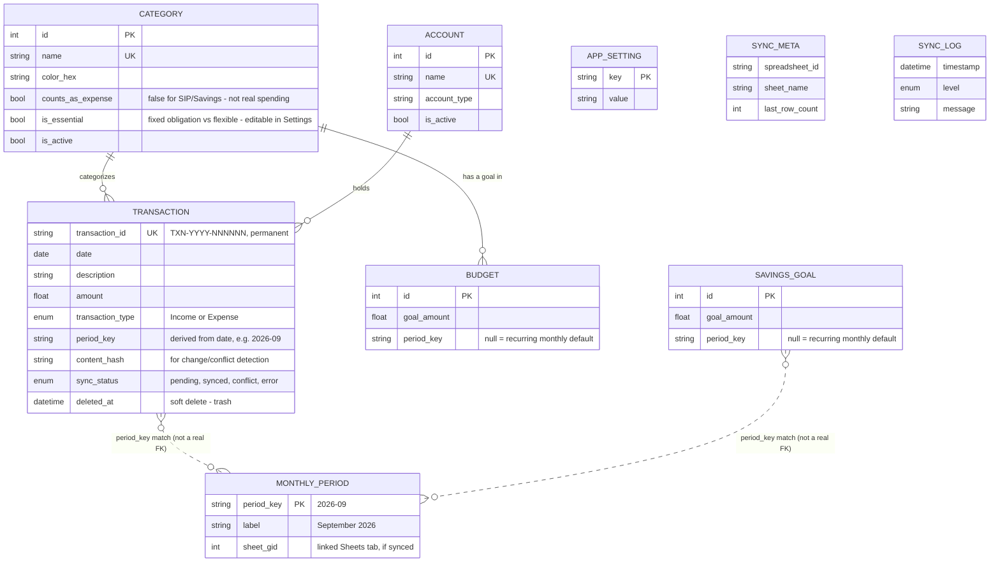

# Budget Tracker

A long-term, extensible budget tracker with two-way Google Sheets sync. A local
SQLite database is the source of truth; Google Sheets is a synchronized,
human-editable mirror. See `../plans` (or ask Claude) for the full design
rationale - the short version:

- **Never loses data**: every write lands in SQLite first; Sheets sync is best-effort
  and retries with backoff.
- **Never depends on row numbers**: every transaction has a permanent `TXN-YYYY-NNNNNN`
  ID; sync always locates rows by scanning for that ID.
- **Works for any year, indefinitely**: months/weeks/years are derived from
  transaction dates, nothing is hard-coded to 2026.
- **Conflicts are surfaced, never silently overwritten**: the Conflicts page lets
  you pick "Keep App" or "Keep Sheets" per transaction.
- **Backend and frontend are separate**: `backend/` is a FastAPI JSON API
  (Python); `frontend/` is a React + Vite + TypeScript single-page app. FastAPI
  serves the frontend's built output directly, so it's still one process, one
  port (`http://127.0.0.1:8000`) day to day.

## Architecture



Every write lands in SQLite first, through the API; the sync engine runs on a
background schedule (and on-demand via "Sync Now") to reconcile SQLite with
Sheets in both directions. The LLM router loads each local model once and
routes each AI feature (autocomplete, categorize, quick-add, the Dashboard's
AI-generated explanation, anomaly detection's summary, "ask your budget") to
whichever model is configured for it - a small model for per-keystroke tasks,
a larger one for anything that can afford to be slower. A model loads lazily
on first use unless it's in the small eagerly-loaded set (autocomplete/
categorize, warmed at startup); the Ask page instead calls `/api/llm/
model_status` and `/api/llm/warmup` itself the moment it opens, so it can show
an explicit "loading the model" state up front rather than the first real
question silently taking up to a minute.

"Ask your budget" never lets the model do arithmetic: a grammar-constrained
JSON call turns the question into a structured query (categories, an optional
keyword search against transaction descriptions, a date range, and an
aggregation - sum/count/avg/or a category breakdown), Python computes the
exact answer against `Transaction` directly, and only then does a second,
short LLM call phrase that already-computed number into a sentence. Each
question and its answer are saved as a `ChatMessage` under a `ChatThread` (the
Ask page's tabs), so history survives a reload; a thread also includes its
last few exchanges in the next question's prompt, so follow-ups like "what
about last month?" resolve correctly.

## Data model



`Transaction` is the only table most features touch - `category_id`/`account_id`
are real foreign keys, but `period_key` (also on `Budget` and `SavingsGoal`) is
just a derived string (`YYYY-MM`) compared by value, not a foreign key -
`MonthlyPeriod` exists purely to remember which Sheets tab (`sheet_gid`) backs
each period, not to constrain anything. `SyncMeta`/`SyncLog` track the sync
engine's own state and aren't referenced by anything else. `dashboard/
calculations.py` (the single source of truth for every number shown anywhere)
reads `Transaction` joined to `Category`/`Account` directly - it never goes
through the API layer.

## First-time setup

1. Double-click `run.bat` (repo root). It builds the frontend (`npm install` +
   `npm run build`), creates a Python 3.13 virtual environment for the
   backend, installs dependencies, creates `backend/.env` from
   `backend/.env.example` (first run only), and opens
   http://127.0.0.1:8000 in your browser.
2. The Dashboard and Transactions pages work immediately from the seeded
   historical data - no Google account needed yet.
3. When you're ready to turn on sync, follow `backend/docs/service_account_setup.md`
   (about 5 minutes), then edit `backend/.env` with your credentials path and
   restart `run.bat`.
4. **To stop**: close the console window or press Ctrl+C in it. `run.bat`
   deletes `backend/.venv` on the way out to save disk space, and rebuilds it
   fresh (a ~10-20s pip install) the next time you launch it.
   `frontend/node_modules` and `frontend/dist` are **not** deleted - npm
   installs are slow, so only the Python venv gets the fresh-each-launch
   treatment. `.env` and `data/budget_tracker.db` are untouched either way.

## Running with Docker (alternative to `run.bat`)

```
docker compose up --build
```
This builds the frontend and backend into one image (`Dockerfile`, multi-stage:
Node builds the React app, Python serves it) and starts it at
`http://127.0.0.1:8000`. Requires `backend/.env` to already exist (copy from
`backend/.env.example` if you haven't run `run.bat` at least once) and your
service account key at `../credentials.json` relative to this repo - adjust
the source path in `docker-compose.yml`'s `volumes:` section if yours lives
elsewhere. `GOOGLE_SERVICE_ACCOUNT_KEY_PATH` from `backend/.env` is
automatically overridden to the in-container mount path, since the Windows
host path in `.env` wouldn't resolve inside the container.

`backend/data/` is bind-mounted so the SQLite database survives
`docker compose down` / rebuilds. Stop with `docker compose down`; add `-v`
only if you also want to discard the data volume (you don't, normally -
`backend/data` is a bind mount to your own filesystem, not a Docker volume,
so your data is already safe on disk either way).

**Note**: I wrote and validated this compose file's config (`docker compose
config` resolves correctly - env vars merge, volume paths resolve to the
right absolute paths) but couldn't actually build or run the image, since
Docker Desktop's engine wasn't running in this environment. Run `docker
compose up --build` yourself to confirm the image actually builds and starts
cleanly before relying on it.

## Project layout

```
budget_tracker/
  run.bat                the one entry point - builds frontend, starts backend
  backend/
    app/
      models.py, repositories/    the database and its access layer
      sheets/                      all Google Sheets API calls (only place that talks to Google)
      sync/                        two-way sync engine, background scheduler, report generation
                                    (the human-readable monthly/weekly/yearly/Dashboard sheet tabs)
      dashboard/calculations.py    every number shown anywhere comes from here
      api/                         the REST/JSON API - the only thing the frontend talks to
      auth.py                      optional HTTP Basic Auth (off unless configured)
      cli.py                       command-line interface
    scripts/seed_from_existing_xlsx.py   the one-time historical importer
    tests/                         pytest suite - fake Sheets adapter, in-memory SQLite
    docs/service_account_setup.md
    data/budget_tracker.db
  frontend/
    src/
      pages/            Dashboard, Transactions, Conflicts, Settings, Logs
      components/       NavBar, SyncStatus, chart cards, KPI tiles, etc.
      lib/api.ts         typed fetch wrappers - one function per backend endpoint
    dist/                the built app FastAPI serves (generated, gitignored)
```

## Importing the historical data (already done once)

The five months of data from the old spreadsheet were imported via:
```
cd backend
python scripts/seed_from_existing_xlsx.py "../../Monthly Budget Sagnik Das.xlsx"
```
This only needs to run once - re-running it against the same file will create
duplicate transactions (it always assigns fresh IDs), so don't re-run it
unless you first clear `backend/data/budget_tracker.db`.

## Everyday use

- **Web UI**: Dashboard / Transactions / Conflicts / Settings / Logs, all in the
  top nav. "Sync Now" is available from any page's top-right status widget.
  The Dashboard's charts have a type switcher (bar/line/pie/donut/sunburst
  where it makes sense), the KPI tiles are drag-to-reorder, and clicking a
  category in the breakdown chart drills into its transactions.
- **CLI** (needs `backend/.venv`, which only exists while `run.bat`'s window
  is open - run these from a *second* terminal):
  ```
  cd budget_tracker/backend
  .venv\Scripts\activate
  python -m app.cli add-transaction -d "Coffee" -a 150 -t Expense -c Shopping
  python -m app.cli list --year 2026 --month 9
  python -m app.cli dashboard --range this_month
  python -m app.cli sync-now
  python -m app.cli category add "Pets" --color "#e87ba4"
  python -m app.cli category list
  ```
- Categories, accounts, per-category budgets, and the overall Net Savings goal
  are all editable from **Settings** (or the CLI/API) - the seeded defaults
  are just a starting point.
- **Frontend dev mode** (hot reload while editing `frontend/src/`): with the
  backend already running via `run.bat`, open a second terminal:
  ```
  cd budget_tracker/frontend
  npm run dev
  ```
  This serves the frontend on its own port (usually :5173) and proxies
  `/api/*` calls to the backend on :8000 (configured in `vite.config.ts`).
  Changes to `.tsx`/`.css` files show up instantly. This is separate from
  what `run.bat` runs day to day (`npm run build`, served by FastAPI).

## Running tests

```
cd backend
python -m pytest tests/
```
Tests run against an in-memory SQLite database and a fake Sheets adapter - no
network calls, no real Google credentials needed.

## A note on Python version

`run.bat` pins the backend's virtual environment to Python 3.13 explicitly
(`py -3.13`), independent of whatever else is installed on this machine -
including the Python 3.9 install used by other projects here, which is
untouched and unaffected by anything in this repo.
